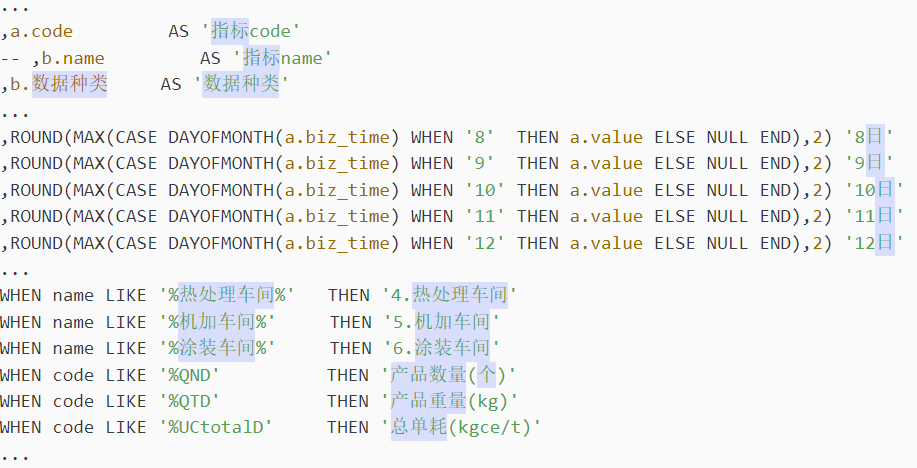
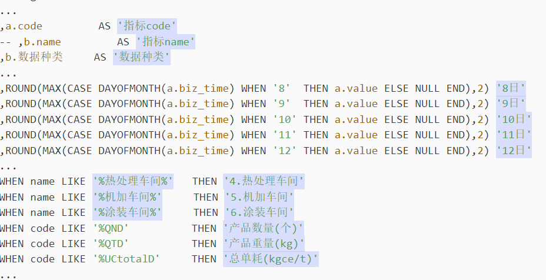

# 匹配中文

中文的字符编码范围可以通过[查找Unicode](https://www.qqxiuzi.cn/zh/hanzi-unicode-bianma.php)来确定。

一般情况下我们使用`4e00-9fa5`来界定中文范围已经可以了。

正则表达式中支持对Unicode字符的解析，格式为 \unnnn，其中的`\u` 标识Unicode， `nnnn` 为Unicode码表值。

```log
...
,a.code         AS '指标code'
-- ,b.name         AS '指标name'
,b.数据种类 	AS '数据种类'
...
,ROUND(MAX(CASE DAYOFMONTH(a.biz_time) WHEN '8'  THEN a.value ELSE NULL END),2) '8日'
,ROUND(MAX(CASE DAYOFMONTH(a.biz_time) WHEN '9'  THEN a.value ELSE NULL END),2) '9日'
,ROUND(MAX(CASE DAYOFMONTH(a.biz_time) WHEN '10' THEN a.value ELSE NULL END),2) '10日'
,ROUND(MAX(CASE DAYOFMONTH(a.biz_time) WHEN '11' THEN a.value ELSE NULL END),2) '11日'
,ROUND(MAX(CASE DAYOFMONTH(a.biz_time) WHEN '12' THEN a.value ELSE NULL END),2) '12日'
...
WHEN name LIKE '%热处理车间%'   THEN '4.热处理车间'
WHEN name LIKE '%机加车间%'     THEN '5.机加车间'
WHEN name LIKE '%涂装车间%'     THEN '6.涂装车间'
WHEN code LIKE '%QND'   	   THEN '产品数量(个)'
WHEN code LIKE '%QTD'     	   THEN '产品重量(kg)'
WHEN code LIKE '%UCtotalD'     THEN '总单耗(kgce/t)'
...
```

## 1.匹配上面列出的日志内容里的中文

正则表达式：`[\u4e00-\u9fa5]+`

匹配结果：



## 2.匹配引号内存在中文的情况

正则表达式：`'\S*?[\u4e00-\u9fa5]+\S*?'`

匹配结果：

